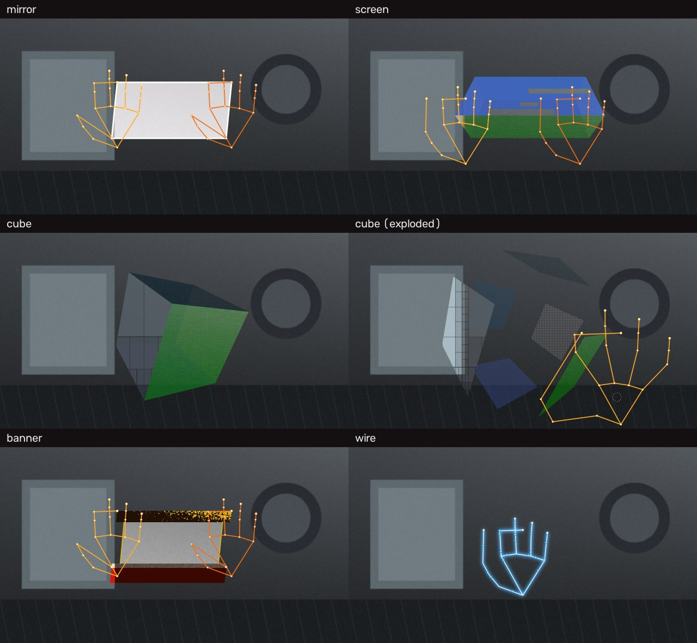

**中文** · [English](README.en.md) · [日本語](README.ja.md)

# manual-tracking

实时手部特效（纯 Python）：MediaPipe 手部追踪 + OpenCV，把**折纸镜面 / 彩色玻璃盒 / 悬浮立方体 / TouchDesigner 横幅 / 霓虹骨架**五种效果贴在你自己的手上。一台 Mac、一个内置摄像头、不要 GPU，1080p 全程 30 fps。



（合成手 + 程序生成背景的示意图，`tools/gallery.py` 可重现；实机效果贴在你自己的手上，比这好看。）

## 快速开始

```bash
git clone https://github.com/Eureka0w0v0/manual-tracking.git
cd manual-tracking
./run.sh                 # 建 venv、装依赖、下载模型(7.5MB, sha256 校验)、进悬浮立方体
```

系统弹「访问摄像头」→ 允许。把手伸到镜头前。`S` 换风格，`Q` 退出。
双击 `start-live.command` 也一样（它会先替你触发权限弹窗）。

要求：macOS（实测）+ Python 3.12–3.14。Linux / Windows 没验证过，代码里有退化分支，见教程末尾。

**完整教程**（安装、每种手势怎么做、调参、录制、离线渲染、排障、架构）→ [`docs/TUTORIAL.md`](docs/TUTORIAL.md)

## 五种风格

`S` 键按这个顺序循环，`--style` 直接指定。旧名（`fabric`/`frame`/`planes`/`fluid` → mirror，`track` → screen，`outline` → wire）仍可用。

- **`mirror` 折纸镜面**——角钉在双手拇指尖+食指尖；平摊是一张反相镜面的纸（`clamp(283−0.56×背景)`），翻一只手那半张变暗折起，两手错位拧成麻花，两手捏死压成双瓣细线。
- **`screen` 彩色玻璃盒**——双手撑起一个**参数化刚体长方体**：手不钉顶点，只给几个低噪参数（每手 掌心↔指弧中点插值 = 锚点 → 长轴与盒长；指弧展开量 → 盒高；掌宽比 → 长轴深度分量；掌面朝向 → 绕长轴 roll），长方体在 3D 里造好再弱透视投影——刚性和两点透视是构造出来的。面可见性用 3D 外法线 + Lambert 光照。**双手靠拢 → 压扁收起，拉开 → 长出重现**。六个面六种像素处理：

  | 面 | 处理 | 来源 |
  |---|---|---|
  | 顶 | 蓝反相 gradient map + 横条 glitch | 原片逐像素实测 |
  | 前 | riso 套色版画（双色 + 通道错位边条 + 抖动） | TD 屏录复刻 |
  | 背 | 硬阈值双色（丝网印/宝丽来） | TD 屏录复刻 |
  | 底 | 点云 / 全息（单目近似，局部对比度当伪深度） | TD 屏录复刻 |
  | 左端 | 四叉树自适应马赛克 | TD 屏录复刻 |
  | 右端 | 半调网点（暖白纸+墨点） | 自由创作 |

  每个常数怎么从原片反解出来、试过什么被否掉，见 [`docs/GLASS_BOX_GEOMETRY.md`](docs/GLASS_BOX_GEOMETRY.md)。

- **`cube` 悬浮立方体**——和 `screen` 的根本区别是**它有自己的位姿**：立方体自己存着位置/朝向/大小，手只是控制器，松手后它留在原地慢慢自转（≈10°/秒）。六个面复用上面那六种处理。

  | 手势 | 作用 |
  |---|---|
  | 单手**捏在立方体上**拖动 | 转动：横拖绕竖轴、竖拖绕横轴。抓住的瞬间捏点炸开一圈**涟漪**当回执；捏在空气里无效——抓取 = 捏合 ∧ 捏点落在盒上。建立后拖到哪都跟手，检测掉帧 ~0.25 s 内不脱手，单帧"松开"尖峰不算松 |
  | 双手**都捏在立方体上** | 平移（跟两手中点）+ 缩放（跟两手距离）+ **拧转**（两手像拧方向盘 → 绕屏幕法线滚，补上拖动够不到的第三轴） |
  | **五指张开** | **炸开视图**：六个面沿各自法线飞离体心悬停——唯一能同时看全六种像素处理的姿态；握拳/放下手收拢 |
  | 松开 | 带走动量：转动继续滑、平移继续漂、**碰到画面边缘反弹**，摩擦渐停后回到悠闲自转。`F` 开重力后松手走**抛物线**，落地弹跳滚停 |

  转动用的是**拖动增量**而不是手掌朝向，所以往一个方向一直拖能无限翻下去，不会像 `screen` 那样翻到某个角度自己转回来（`screen` 受制于掌面朝向的 cos 型饱和，见 `docs/GLASS_BOX_GEOMETRY.md` §6）。手感有自动断言：`tools/cube_check.py`。

- **`banner` TouchDesigner 横幅**——黄阈值头带 / X-ray 中窗 / 白分隔线 / 悬出红脚带，全部是摄像头画面的屏幕空间双色调。
- **`wire` 霓虹电流骨架**——辉光 + 芯线 + 沿骨骼流动的光点。不需要手势，最便宜的风格。

## 键位

| 键 | 作用 |
|---|---|
| `S` | mirror / screen / cube / banner / wire |
| `D` | 实拍底 / 黑底 |
| `o` `p` | 实拍底亮度（暗 / 亮） |
| `R` | 录制（按实测帧率、不含 HUD）→ `output/live_*.mp4` |
| `Q` / `Esc` | 退出 |

`screen` 的实时调参（HUD 同步显示当前值）：

| 键 | 参数 | 作用 |
|---|---|---|
| `[` `]` | `roll_expo` | 翻转曲线陡度（小=灵敏，大=中心钝但静止更稳） |
| `;` `'` | `anchor_lift` | 盒子挂多高（0=掌心，1=指弧中点） |
| `,` `.` | `depth_bias` | 绕长轴旋转的不动点（0=前面，0.5=体心，1=后面） |
| `7` `8` | `roll_max_rate` | 角速度上限 °/帧（挡掉掌面朝向饱和区翻符号造成的瞬移；压颜色频闪的主控） |
| `9` `0` | `roll_resp` | 旋转跟手程度（大=跟手，小=顺滑） |
| `g` `h` | `face_alpha` | 玻璃通透度（内壁 alpha 按 0.42 倍跟着走） |
| `-` `=`（或 `_` `+`） | `anchor_resp` | 锚点跟手程度（大=跟手，小=稳但钝） |
| `<` `>` | `gap_shut` | 双手靠多近才收起盒子（按掌宽归一，与手离镜头远近无关） |
| `{` `}` | `box_edge_w` | 盒子棱线粗细 px（0=无缝，默认 0） |

`cube` 的实时调参：

| 键 | 参数 | 作用 |
|---|---|---|
| `9` `0` | `orbit_gain` | 拖 1 px 转多少（大=一点点手就翻一圈） |
| `g` `h` | `face_alpha` | 玻璃通透度 |
| `{` `}` | `box_edge_w` | 棱线粗细 |
| `F` | `gravity` | 重力开关 |
| `X` | — | 位姿归位（转乱了 / 推到边上时按） |

三张表**按风格分流**：在用不上某个键的风格里按它，终端会说一句 `[ 只对 screen 有用 (当前 cube)`，而不是默默改一个不影响画面的字段。开机横幅和这条提示由同一张键位表生成，不手抄。

HUD 末尾显示当前朝向镜头的面（如 `顶+前`）——调 roll 时用来区分「几何没转到」和「画了但读不出来」。

## 命令行

```bash
./run.sh live                              # 默认风格 cube、1920x1080，自动挑本机内置摄像头
./run.sh live --style screen               # 直接进玻璃盒
./run.sh live --fps 60                     # 请求 60fps 采集（需摄像头支持；检测 6.9ms，喂得饱）
./run.sh live --window-scale 1.4           # 窗口开大点（也可直接拖拽边角）
./run.sh run  -i in.mp4 -o out.mp4 --style screen   # 离线渲染一段视频
./run.sh dump -i in.mp4 -o landmarks.json           # 导出每帧 21 点 JSON（AE / TD 用）
python main.py live --style mirror         # IDE 友好入口，参数同上
```

全部参数与 JSON 格式见 [`docs/TUTORIAL.md` §6](docs/TUTORIAL.md#6-命令行完整参考)。

**不要**直接执行 `src/manual_tracking/__main__.py`——它用相对导入，只能走 `python -m manual_tracking`；`main.py` 存在的唯一理由就是替 IDE 绕开这条规则。包故意不做 pip install，`run.sh` / `main.py` / `.vscode` 都替你设了 `PYTHONPATH=src`。

首次运行自动下载 MediaPipe 手部模型到 `models/`（官方 URL 带版本号，内容不可变，sha256 校验）。想用自己的模型 `--model /path/to/xxx.task`（显式指定时**不会**自动下载）。

## 想改什么，去哪个文件

可调常数放在各自负责的模块顶部，每个都带一句「为什么是这个数」；实时键改的是同名字段，退出后恢复默认。

| 想调的东西 | 文件 |
|---|---|
| 每个面的像素处理（riso / 硬阈值 / 点云 / 四叉树 / 网点 / 蓝顶 glitch） | `effects.py` |
| `screen` 的盒子几何与滤波 | `glassbox.py` |
| `cube` 的手感（增益、惯性、重力、炸开、抓取判据） | `floatcube.py` |
| `mirror` / `banner` / `wire` 三种风格 | `sheet.py` / `banner.py` / `neon.py` |
| 长方体的顶点序与弱透视投影（`screen` 与 `cube` 共用的**唯一**一份） | `boxgeom.py` |
| 多边形填充、描边这些绘制原语 | `paint.py` |
| 手部滤波（One Euro、轨迹、handedness 锁存） | `tracker.py` |
| 检测线程与速度外推 | `detect_service.py` |
| 键位、录制、HUD、主循环 | `live.py` |

`renderer.py` 只剩「按 style 分派 + `screen`/`cube` 的绘制 + 底图缓存 + 左右手角色滞回」。架构导览见 [`docs/TUTORIAL.md` §8](docs/TUTORIAL.md#8-它是怎么工作的架构导览)。

## 开发

```bash
.venv/bin/pip install -r requirements-dev.txt
.venv/bin/ruff check main.py src tools tests                # 静态检查（配置在 pyproject.toml）
.venv/bin/pytest                                           # 纯逻辑契约 + 渲染冒烟，163 条，<1 秒
PYTHONPATH=src .venv/bin/python tools/cube_check.py        # cube 手感底线，27 条断言
PYTHONPATH=src .venv/bin/python tools/e2e_check.py         # screen 手感底线，3 条断言（需样片，见下）
PYTHONPATH=src .venv/bin/python tools/e2e_check.py --sweep # 扫 expo/cap 找参数
```

验证分三层，各挡各的：

| 层 | 位置 | 挡什么 | 依赖 |
|---|---|---|---|
| 契约 | `tests/` | 改错了会崩：面拓扑与顶点序对齐、effect 的尺寸/不可变契约、盒子刚性、别名表、handedness 滞回、外推与录制帧率、键位分流、入口默认值、模型下载校验、收尾释放 | 无（合成手，不读素材） |
| 手感 | `tools/cube_check.py` | 拖不动、转回头、松手乱飘、撑出画面 | 无（合成手） |
| 回归 | `tools/e2e_check.py` | 改差了不好用：颜色频闪、背面读不出 | 样片 + 模型 |

前两层不碰摄像头、不读素材、不下模型，每次 push 都在 CI 上跑（`.github/workflows/ci.yml`）。**第三层留在本地**——CI 绿了不代表没有频闪。改完 `screen` 的几何/映射/滤波必须跑 `e2e_check`：它是唯一能发现「可见面每秒切换 5 次」这类体感灾难的手段。

`assets/sample.mp4` **不在仓库里**（它是原作者的抖音视频，不能替人传播）：想跑第三层，放一段自己的 1080p/30fps 双手翻转录像到这个路径。`docs/` 里的所有数字都是对那段原片测的，换了素材要按 `docs/GLASS_BOX_GEOMETRY.md` §3.7 的方法用 `--sweep` 自己重标基线。

`tools/synth.py` 是 `tests/` 和 `cube_check` 共用的合成手；`tools/gallery.py` 用它渲染顶部那张示意图。

## 文档

- [`docs/TUTORIAL.md`](docs/TUTORIAL.md)——使用教程：安装、每种手势、调参、录制、离线渲染与 JSON、改参数去哪、架构导览、加新风格、常见问题（[English](docs/TUTORIAL.en.md) · [日本語](docs/TUTORIAL.ja.md)）
- [`docs/GLASS_BOX_GEOMETRY.md`](docs/GLASS_BOX_GEOMETRY.md)——玻璃盒标定：每个常数怎么从原片反解、滤波与限幅的实测网格、试过被否掉的方案（正文中文，开头有英/日摘要）
- [`docs/TOUCHDESIGNER_SETUP.md`](docs/TOUCHDESIGNER_SETUP.md)——想在 TouchDesigner 里做同类效果：torinmb/mediapipe-touchdesigner 插件安装（正文中文，开头有英/日摘要）

## 来源与致谢

- 手部追踪：[MediaPipe Hand Landmarker](https://developers.google.com/mediapipe/solutions/vision/hand_landmarker)（Google）。
- 效果参考：抖音上「manualtracking / AM」的折纸镜面与玻璃盒（颜色与几何参数来自对原视频的逐像素逆向测量），以及「Github上的TouchDesigner项目」那类 TD 屏录（riso / 硬阈值 / 点云 / 四叉树四种面）。TD 底座是 [torinmb/mediapipe-touchdesigner](https://github.com/torinmb/mediapipe-touchdesigner)。
- 本仓库**不包含**任何原视频素材。

## License

[MIT](LICENSE)
